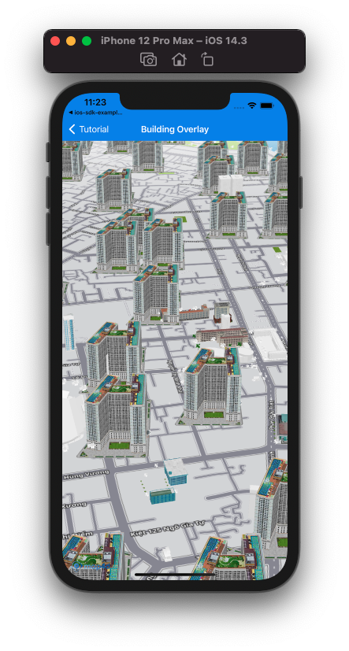

# Building Overlay

Building overlay là một loại overlay cho phép người dùng hiển thị các building từ nhiều nguồn khác nhau lên bản đồ, kết hợp với building sẵn có của Map4D.  
Building overlay chỉ hiển thị ở chế độ 3D.



## Add Building overlay

Để thêm 1 building overlay vào map cần tạo mới 1 đối tượng của lớp [MFURLBuildingLayer](/reference/building-overlay?id=mfurlbuildinglayer-class) sau đó set `map` cho building overlay đó.  
Hàm khởi tạo của lớp [MFURLBuildingLayer](/reference/building-overlay?id=mfurlbuildinglayer-class) yêu cầu đối tượng implement protocol [MFBuildingURLConstructor](/reference/building-overlay?id=mfbuildingurlconstructor-protocol)  

Implement **MFBuildingURLConstructor** protocol yêu cầu 2 phương thức `getBuildingUrlWith` và `parserBuildingData`.  
Trong đó:  
- getBuildingUrlWith: Nhận vào các giá trị là toạ độ x, y và mức zoom của tile, kết quả là một kiểu [URL](https://developer.apple.com/documentation/foundation/url) chỉ đến rest api cung cấp dữ liệu building theo tile.
- parserBuildingData: Nhận vào là dữ liệu được về từ api cung cấp bởi *getBuildingUrlWith*, ta sẽ phải parser dữ liệu đó thành mảng các đối tượng [MFBuildingData](/reference/building-overlay?id=mfbuildingdata-class)

### Tạo mới Building overlay

Đoạn code bên dưới hướng dẫn cách implement [MFBuildingURLConstructor](/reference/building-overlay?id=mfbuildingurlconstructor-protocol) và tạo đối tượng [MFURLBuildingLayer](/reference/building-overlay?id=mfurlbuildinglayer-class)

<!-- tabs:start -->
#### ** Swift **
Implement **MFBuildingURLConstructor**
```swift
class BuildingURLConstructor : NSObject, MFBuildingURLConstructor {
  func getBuildingUrlWith(x: UInt, y: UInt, zoom: UInt) -> URL? {
    let url = "https://poi-random.herokuapp.com/poi/\(zoom)/\(x)/\(y)"
    return URL(string: url)
  }
  
  func parserBuildingData(_ data: String) -> [MFBuildingData]? {
    do {
      var buildingDatas:[MFBuildingData] = []
      let decoder = JSONDecoder()
      let poisJson = try decoder.decode(POIsJson.self, from: data.data(using: .utf8)!)
      
      guard let places = poisJson.pois else { return nil }
      for place in places {
        guard let placeId = place.id else { continue }
        let position = CLLocationCoordinate2DMake(place.position?.lat ?? 0, place.position?.lng ?? 0)
        let model = "https://sw-hcm-1.vinadata.vn/v1/AUTH_d0ecabcbdcd74f6aa6ac9a5da528eb78/sdk/models/5b21d9a5cd18d02d045a5e99"
        let texture = "https://sw-hcm-1.vinadata.vn/v1/AUTH_d0ecabcbdcd74f6aa6ac9a5da528eb78/sdk/textures/0cb35e1610c34e55946a7839356d8f66.jpg"
        let building = MFBuildingData(id: placeId, position: position, model: model, texture: texture)
        buildingDatas.append(building)
        break;
      }
      
      return buildingDatas;
    } catch let err {
      print(err.localizedDescription)
      return nil
    }
  }
}
```

Tạo đối tượng **MFURLBuildingLayer**
```swift
let urlConstructor = BuildingURLConstructor()
let buildingOverlay = MFURLBuildingLayer(urlConstructor: urlConstructor, prefixId: "building-layer-")
```
#### ** Objective-C **
Implement **MFBuildingURLConstructor**
```objc
#import <Map4dMap/Map4dMap.h>
@interface BuildingURLConstructor : NSObject <MFBuildingURLConstructor>
@end

@implementation BuildingURLConstructor

- (NSURL * _Nullable)getBuildingUrlWithX:(NSUInteger)x y:(NSUInteger)y zoom:(NSUInteger)zoom {
  NSString *url = [NSString stringWithFormat:@"https://poi-random.herokuapp.com/poi/%lu/%lu/%lu", zoom, x, y];
  return [NSURL URLWithString:url];
}

- (NSArray<MFBuildingData *> * _Nullable)parserBuildingData:(NSString * _Nonnull)data {
  @try {
    NSData* jsonData = [data dataUsingEncoding:NSUTF8StringEncoding];
    NSError *jsonError;
    NSDictionary *jsonObject = [NSJSONSerialization JSONObjectWithData:jsonData options:kNilOptions error:&jsonError];
    
    if (jsonObject != nil) {
      NSArray *places = [jsonObject valueForKey:@"pois"];

      if (places != nil && places.count > 0) {
        NSMutableArray *buildingDatas = [[NSMutableArray alloc] init];
        
        for (int i = 0; i < places.count; i++) {
          NSDictionary *place = [places objectAtIndex:i];
          if (place == nil) {
            continue;
          }
          
          NSString *placeId = [place valueForKey:@"id"];
          NSString *title = [place valueForKey:@"title"];
          NSDictionary *positionObject = [place valueForKey:@"position"];
          if (placeId == nil || title == nil || positionObject == nil) {
            continue;
          }
          
          NSNumber *latObject = [positionObject valueForKey:@"lat"];
          NSNumber *lngObject = [positionObject valueForKey:@"lng"];
          if (latObject == nil || lngObject == nil) {
            continue;
          }
          
          MFBuildingData *buildingData = [[MFBuildingData alloc] init];
          buildingData.id = placeId;
          buildingData.name = title;
          buildingData.position = CLLocationCoordinate2DMake(latObject.doubleValue, lngObject.doubleValue);
          buildingData.model = @"https://sw-hcm-1.vinadata.vn/v1/AUTH_d0ecabcbdcd74f6aa6ac9a5da528eb78/sdk/models/5b21d9a5cd18d02d045a5e99";
          buildingData.texture = @"https://sw-hcm-1.vinadata.vn/v1/AUTH_d0ecabcbdcd74f6aa6ac9a5da528eb78/sdk/textures/0cb35e1610c34e55946a7839356d8f66.jpg";
          [buildingDatas addObject:buildingData];
          break;
        }
        
        return buildingDatas;
      }
    }

    return nil;
  }
  @catch (NSException *exception) {
    return nil;
  }
}

@end
```

Tạo đối tượng **MFURLBuildingLayer**
```objc
BuildingURLConstructor *urlConstructor = [[BuildingURLConstructor alloc] init];
MFURLBuildingLayer *buildingOverlay = [MFURLBuildingLayer buildingLayerWithURLConstructor:urlConstructor prefixId:@"building-"];
```
<!-- tabs:end -->

### Add Building overlay lên Map

Để vẽ building overlay lên map, ta set map view cho property `map` của đối tượng **MFURLBuildingLayer**

<!-- tabs:start -->
#### ** Swift **
```swift
buildingOverlay.map = mapView
```
#### ** Objective-C **
```objc
buildingOverlay.map = self.mapView;
```
<!-- tabs:end -->

### Remove Building overlay

Để xóa building overlay khỏi map, ta set property `map` của đối tượng **MFURLBuildingLayer** thành `nil`

<!-- tabs:start -->
#### ** Swift **
```swift
buildingOverlay.map = nil
```
#### ** Objective-C **
```objc
buildingOverlay.map = nil;
```
<!-- tabs:end -->

### Ẩn/Hiện Building Overlay

Set giá trị cho property `isHidden` để ẩn/hiện building overlay.  
**Chú ý**: Mặc dù building overlay không hiển thị nhưng quá trình tải các building vẫn diễn ra

<!-- tabs:start -->
#### ** Swift **
```swift
buildingOverlay.isHidden = true
```
#### ** Objective-C **
```objc
buildingOverlay.isHidden = YES;
```
<!-- tabs:end -->

## Sự kiện đối với building thuộc building overlay

Các sự kiện đối với building thuộc building overlay phát sinh tương tự với building của Map4D, việc xử lý được diễn ra ngay tại hàm xử lý sự kiện của Map4D.

<!-- tabs:start -->
#### ** Swift **
```swift
func mapView(_ mapView: MFMapView!, didTapBuildingWithBuildingID buildingID: String!, name: String!, location: CLLocationCoordinate2D)
```
#### ** Objective-C **
```objc
- (void)mapView: (MFMapView*)  mapView didTapBuildingWithBuildingID: (NSString*) buildingID name: (NSString*) name location: (CLLocationCoordinate2D) location;
```
<!-- tabs:end -->
