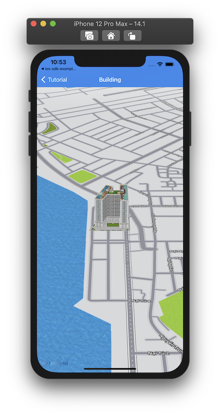
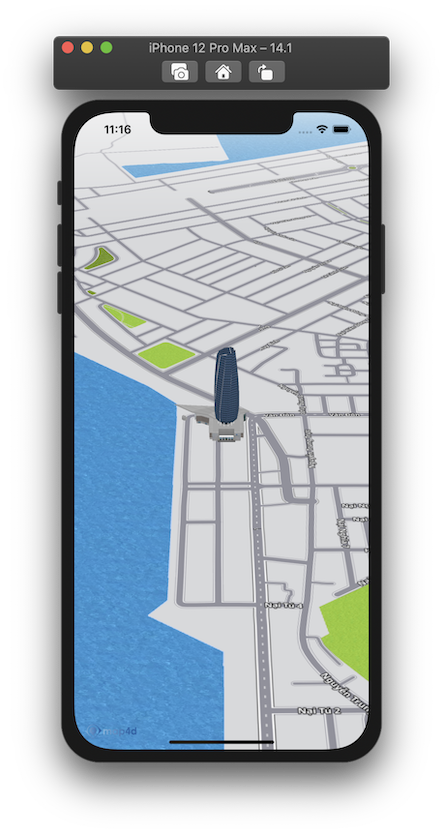

# Building

> Điểm khác biệt giữa nền tảng bản đồ **Map4D** với các nền tảng bản đồ khác đó là chế độ bản đồ 3D. Chế độ này sẽ có các đối
tượng 3D mô phỏng lại các tòa nhà, cây cối, các cây cầu cũng như các công trình kiến trúc khác, ... Ngoài những đối tượng **Building 3D** 
có sẵn của bản đồ, bạn còn có thể tự tạo và thêm đối tượng 3D của bạn lên bản đồ thông qua đối tượng **MFBuilding**

**Chú ý**: Những đối tượng **Building** này chỉ được vẽ trong chế độ 3D của bản đồ, nó không được vẽ trong chế độ 2D.

### 1. Thêm một Building

Chúng ta thử tạo **Building** như sau:

<!-- tabs:start -->

#### ** Swift **

```swift 
let building = MFBuilding()
building.position = CLLocationCoordinate2D(latitude: 16.08795975082965, longitude: 108.22837829589844)
building.name = "User Building"
building.model = "https://sw-hcm-1.vinadata.vn/v1/AUTH_d0ecabcbdcd74f6aa6ac9a5da528eb78/sdk/models/5b21d9a5cd18d02d045a5e99"
building.texture = "https://sw-hcm-1.vinadata.vn/v1/AUTH_d0ecabcbdcd74f6aa6ac9a5da528eb78/sdk/textures/0cb35e1610c34e55946a7839356d8f66.jpg"
building.map = mapView
```

#### ** Objective C **

```objc 
MFBuilding *building = [[MFBuilding alloc] init];
[building setPosition: CLLocationCoordinate2DMake(16.08795975082965, 108.22837829589844)];
[building setName: @"User Building"];
[building setModel: @"https://sw-hcm-1.vinadata.vn/v1/AUTH_d0ecabcbdcd74f6aa6ac9a5da528eb78/sdk/models/5b21d9a5cd18d02d045a5e99"];
[building setTexture: @"https://sw-hcm-1.vinadata.vn/v1/AUTH_d0ecabcbdcd74f6aa6ac9a5da528eb78/sdk/textures/0cb35e1610c34e55946a7839356d8f66.jpg"];
[building setMap: mapView];
```

<!-- tabs:end -->

-   


### 2. Xóa Building khỏi bản đồ

Để xóa **Building** khỏi bản đồ, chúng ta **set** thuộc tính **map** bằng **nil**

<!-- tabs:start -->
#### ** Swift **

```swift
building.map = nil
```

#### ** Objective C **

```objc 
[building setMap: Nil];
```
<!-- tabs:end -->

Nếu bạn muốn quản lý một danh sách các **Building**, bạn nên tạo một **mảng** để chứa các **Building** đó. 

Sử dụng mảng này bạn có thể  **set** lần lượt thuộc tính **map** bằng **mapView** để hiển thị **Building** hoặc **nil** khi bạn cần xóa các **Building**.

### 3. Tùy chỉnh Building

Bạn có thể dễ dàng tuỳ chỉnh **Building** thông qua các thuộc tính mà **MFBuilding** cung cấp như:

  
| Name                       |Description                                                                                                                                             |
|----------------------------|--------------------------------------------------------------------------------------------------------------------------------------------------------|
| **name**                   | Tùy chỉnh tên **Building**                                                                                                                             |
| **position**               | Tùy chỉnh vị trí vẽ **Building**                                                                                                                       |
| **model**                  | Tùy chỉnh đường dẫn http chứa model của **Building**                                                                                                   |
| **texture**                | Tùy chỉnh đường dẫn http chứ texture của **Building**                                                                                                  |
| **coordinates**            | Tùy chỉnh model của **Building** dưới dạng các coordinate (chỉ cần sử dụng một trong 2 thuộc tính **model** hoặc **coordinates** để tạo **Building**)  |
| **selected**               | **set** là **true** nếu muốn hiển thị **Building** dưới dạng được chọn (có viền đỏ bao quanh)                                                          |

<!-- tabs:start -->

#### ** Swift **

```swift 
building.name = "Da Nang Tower"
building.model = "https://sw-hcm-1.vinadata.vn/v1/AUTH_4486f66f671c41bab0d3dea1904626d4/sdk/models/5ca32c3865863cc894adeb06"
building.texture = "https://sw-hcm-1.vinadata.vn/v1/AUTH_4486f66f671c41bab0d3dea1904626d4/sdk/textures/5ca32c3865863cc894adeb07.jpg"
```

#### ** Objective C **

```objc 
[building setName: @"Da Nang Tower"];
[building setModel: @"https://sw-hcm-1.vinadata.vn/v1/AUTH_4486f66f671c41bab0d3dea1904626d4/sdk/models/5ca32c3865863cc894adeb06"];
[building setTexture: @"https://sw-hcm-1.vinadata.vn/v1/AUTH_4486f66f671c41bab0d3dea1904626d4/sdk/textures/5ca32c3865863cc894adeb07.jpg"];
```

<!-- tabs:end -->

-   