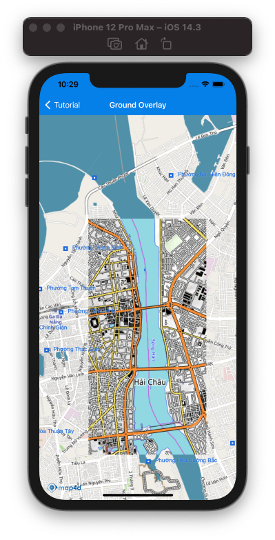

# Ground Overlay

Ground Overlay cho phép người dùng thực hiện việc thay thế tile ở một khu vực nào đó bằng tile từ những nguồn khác.  
Ground Overlay tương tự với Tile Overlay nhưng cho phép người dùng quy định 1 khu vực cụ thể gắn với kinh độ/vĩ độ, ngoài ra con cho phép người dùng loại bỏ việc hiển thị tile và các đối tượng thuộc tile của Map4D SDK



## Add Ground Overlay

Để thêm 1 ground overlay vào map cần tạo mới 1 đối tượng [MFGroundOverlay](/reference/ground-overlay?id=mfgroundoverlay-class) và set map cho đối tượng đó.  
Cần phải implement [MFTileURLConstructor](reference/tile-overlay?id=mftileurlconstructor-protocol) nếu sử dụng *MFTileURLConstructor* để khởi tạo đối tượng *MFGroundOverlay*

### Tạo mới Ground overlay

Đoạn code bên dưới hướng dẫn cách sử dụng implement [MFTileURLConstructor](reference/tile-overlay?id=mftileurlconstructor-protocol) và sử dụng [MFGroundOverlay](/reference/ground-overlay?id=mfgroundoverlay-class) để hiển thị một vùng tile từ `opentopomap`.  
Thuộc tính `overrideBaseMap` cho phép người dùng bỏ qua việc lấy dữ liệu và hiển của Map4D trong khu vực dành cho Ground Overlay  

<!-- tabs:start -->
#### ** Swift **
Implement **MFTileURLConstructor**
```swift
class GroundURLConstructor : NSObject, MFTileURLConstructor {
    func getTileUrlWith(x: UInt, y: UInt, zoom: UInt, is3dMode: Bool) -> URL? {
    let url = "https://a.tile.opentopomap.org/\(zoom)/\(x)/\(y).png"
    return URL(string: url)
    }
}
```
Tạo đối tượng **MFTileURLConstructor**
```swift
let bounds = MFCoordinateBounds(
    coordinate: CLLocationCoordinate2D(latitude: 16.059547034047146, longitude: 108.22125434875488),
    coordinate1: CLLocationCoordinate2D(latitude: 16.075630202564316, longitude: 108.23086738586424)
)
let urlConstructor = GroundURLConstructor()
groundOverlay = MFGroundOverlay(bounds: bounds, tileURLConstructor: urlConstructor, overrideBaseMap: true)
```
#### ** Objective-C **
Implement **MFTileURLConstructor**
```objc
@interface GroundURLConstructor : NSObject<MFTileURLConstructor>
@end

@implementation GroundURLConstructor

- (NSURL * _Nullable)getTileUrlWithX:(NSUInteger)x y:(NSUInteger)y zoom:(NSUInteger)zoom is3dMode:(bool)is3dMode {
  NSString *url = [NSString stringWithFormat:@"https://a.tile.opentopomap.org/%lu/%lu/%lu.png", zoom, x, y];
  return [NSURL URLWithString:url];
}

@end
```
Tạo đối tượng **MFTileURLConstructor**
```objc
CLLocationCoordinate2D coor0 = CLLocationCoordinate2DMake(16.059547034047146, 108.22125434875488);
CLLocationCoordinate2D coor1 = CLLocationCoordinate2DMake(16.075630202564316, 108.23086738586424);
MFCoordinateBounds *bounds = [[MFCoordinateBounds alloc] initWithCoordinate:coor0 coordinate1:coor1];
GroundURLConstructor *urlConstructor = [[GroundURLConstructor alloc] init];
MFGroundOverlay *groundOverlay = [MFGroundOverlay groundOverlayWithBounds:bounds tileURLConstructor:urlConstructor overrideBaseMap:YES];
```
<!-- tabs:end -->

### Add Ground overlay lên map
Để vẽ Ground overlay lên map, ta set [MFMapView]() cho property `map` của đối tượng ground overlay.

<!-- tabs:start -->
#### ** Swift **
```swift
groundOverlay.map = mapView
```
#### ** Objective-C **
```objc
groundOverlay.map = self.mapView;
```
<!-- tabs:end -->

### Remove Ground overlay
Để xóa Ground overlay khỏi map, ta `nil` cho property `map`

<!-- tabs:start -->
#### ** Swift **
```swift
groundOverlay.map = nil
```
#### ** Objective-C **
```objc
groundOverlay.map = nil;
```
<!-- tabs:end -->

### Ẩn/Hiện Ground overlay
Set giá trị cho property `isHidden` để ẩn/hiện ground overlay.
Chú ý:  
- Mặc dù ground overlay không hiển thị nhưng quá trình tải các tile vẫn diễn ra khi kéo map đến khu vực quy định cho ground overlay
- Trong trường hợp set `overrideBaseMap` là true nhưng `isHidden` là `true` thì ground không được hiển thị và khu vực đó cũng không hề hiển thị dữ liệu của Map4D

<!-- tabs:start -->
#### ** Swift **
```swift
groundOverlay.isHidden = true
```
#### ** Objective-C **
```objc
groundOverlay.isHidden = YES;
```
<!-- tabs:end -->
