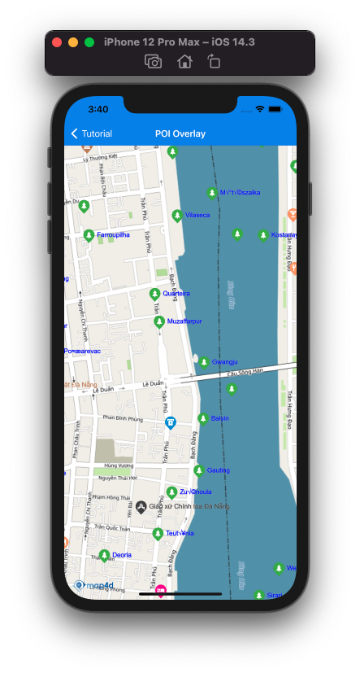

# POI Overlay

POI overlay là một loại overlay cho phép người dùng hiển thị các POI từ nhiều nguồn khác nhau lên bản đồ.  
Các POI của POI overlay được ưu tiên hiển thị so với POI của Map4D và chỉ hiển thị ở chế độ 2D.



## Add POI overlay

Để thêm 1 lớp POI overlay vào map cần tạo mới 1 đối tượng của lớp [MFURLPOILayer](/reference/poi-overlay?id=mfurlpoilayer-class) sau đó set map cho POI overlay đó.
Để tạo đối tượng [MFURLPOILayer](/reference/poi-overlay?id=mfurlpoilayer-class) thì cần phải implement [MFPOIURLConstructor](/reference/poi-overlay?id=mfurlpoilayer-class)

Implement **MFPOIURLConstructor** protocol yêu cầu 2 phương thức `getPOIUrlWith` và `parserPOIData`.  
Trong đó:  
- getPOIUrlWith: Nhận vào các giá trị là toạ độ x, y và mức zoom của tile, kết quả là một kiểu [URL](https://developer.apple.com/documentation/foundation/url) chỉ đến rest api cung cấp dữ liệu POI theo tile.
- parserPOIData: Nhận vào là dữ liệu được về từ api cung cấp bởi *getPOIUrlWith*, ta sẽ phải parser dữ liệu đó thành mảng các đối tượng [MFPOIData](/reference/poi-overlay?id=mfpoidata-class)

### Tạo mới POI overlay

Đoạn code bên dưới hướng dẫn việc implement [MFPOIURLConstructor](/reference/poi-overlay?id=mfurlpoilayer-class) và sử dụng [MFURLPOILayer](/reference/poi-overlay?id=mfurlpoilayer-class) để hiển thị POI overlay lấy từ `poi-random.herokuapp.com`

<!-- tabs:start -->
#### ** Swift **
Implement **MFPOIURLConstructor**
```swift
class POIURLConstructor : NSObject, MFPOIURLConstructor {
    func getPOIUrlWith(x: UInt, y: UInt, zoom: UInt) -> URL? {
        let poiApiUrl = "https://poi-random.herokuapp.com/poi/\(zoom)/\(x)/\(y)"
        return URL(string: poiApiUrl)
    }
    
    func parserPOIData(_ data: String) -> [MFPOIData]? {
        do {
            var poiDatas:[MFPOIData] = []
            let decoder = JSONDecoder()
            let poisJson = try decoder.decode(POIsJson.self, from: data.data(using: .utf8)!)
            
            guard let places = poisJson.pois else { return nil }
            for place in places {
                let position = CLLocationCoordinate2DMake(place.position?.lat ?? 0, place.position?.lng ?? 0)
                let poi = MFPOIData(id: place.id ?? "", position: position, title: place.title)
                poi.titleColor = .blue
                poi.type = "park"
                poiDatas.append(poi)
            }
            return poiDatas;
        } catch let err {
            print(err.localizedDescription)
            return nil
        }
    }
}
```

Create **MFURLPOILayer** và set **map**
```swift
let poiURLConstructor = POIURLConstructor()
let poiOverlay = MFURLPOILayer(urlConstructor: poiURLConstructor, prefixId: "poi-overlay")
poiOverlay.map = mapView
```
#### ** Objective-C **
Implement **MFPOIURLConstructor**
```objc
#import <Map4dMap/Map4dMap.h>
@interface POIURLConstructor : NSObject<MFPOIURLConstructor>
@end

@implementation POIURLConstructor

- (NSURL * _Nullable)getPOIUrlWithX:(NSUInteger)x y:(NSUInteger)y zoom:(NSUInteger)zoom {
  NSString *poiApiUrl = [NSString stringWithFormat:@"https://poi-random.herokuapp.com/poi/%lu/%lu/%lu", zoom, x, y];
  return [NSURL URLWithString:poiApiUrl];
}

- (NSArray<MFPOIData *> * _Nullable)parserPOIData:(NSString * _Nonnull)data {
  @try {
    NSData* jsonData = [data dataUsingEncoding:NSUTF8StringEncoding];
    NSError *jsonError;
    NSDictionary *jsonObject = [NSJSONSerialization JSONObjectWithData:jsonData options:kNilOptions error:&jsonError];
    
    if (jsonObject != nil) {
      NSArray *places = [jsonObject valueForKey:@"pois"];

      if (places != nil && places.count > 0) {
        NSMutableArray *poiDatas = [[NSMutableArray alloc] init];
        
        for (int i = 0; i < places.count; i++) {
          NSDictionary *place = [places objectAtIndex:i];
          if (place == nil) {
            continue;
          }
          
          NSString *placeId = [place valueForKey:@"id"];
          NSString *title = [place valueForKey:@"title"];
          NSDictionary *positionObject = [place valueForKey:@"position"];
          if (placeId == nil || title == nil || positionObject == nil) {
            continue;
          }
          
          NSNumber *latObject = [positionObject valueForKey:@"lat"];
          NSNumber *lngObject = [positionObject valueForKey:@"lng"];
          if (latObject == nil || lngObject == nil) {
            continue;
          }
          
          MFPOIData *poiData = [[MFPOIData alloc] init];
          poiData.id = placeId;
          poiData.title = title;
          poiData.position = CLLocationCoordinate2DMake(latObject.doubleValue, lngObject.doubleValue);
          poiData.titleColor = UIColor.blueColor;
          poiData.type = @"park";
          [poiDatas addObject:poiData];
        }
        
        return poiDatas;
      }
    }

    return nil;
  }
  @catch (NSException *exception) {
    return nil;
  }
}

@end
```

Create **MFURLPOILayer** và set **map**
```objc
POIURLConstructor *urlConstructor = [[POIURLConstructor alloc] init];
MFURLPOILayer *poiOverlay = [MFURLPOILayer poiLayerWithURLConstructor:urlConstructor prefixId:@"poi-layer-1_"];
poiOverlay.map = self.mapView;
```
<!-- tabs:end -->

### Add POI overlay lên Map

Để vẽ POI overlay lên map, ta set map view cho property `map` của đối tượng poi overlay

<!-- tabs:start -->
#### ** Swift **
```swift
poiOverlay.map = mapView
```
#### ** Objective-C **
```objc
poiOverlay.map = self.mapView;
```
<!-- tabs:end -->

### Remove POI overlay

Để xóa POI overlay khỏi map, ta gọi hàm `setMap` và truyền vào giá trị `null`

<!-- tabs:start -->
#### ** Swift **
```swift
poiOverlay.map = nil
```
#### ** Objective-C **
```objc
poiOverlay.map = nil;
```
<!-- tabs:end -->

### Ẩn/Hiện POI Overlay

Để ẩn/hiện POI overlay, ta set giá trị cho property `isHidden` của đối tượng.        
**Chú ý:** Mặc dù POI overlay không hiển thị nhưng quá trình tải các POI vẫn diễn ra

<!-- tabs:start -->
#### ** Swift **
```swift
poiOverlay.isHidden = true;
```
#### ** Objective-C **
```objc
poiOverlay.isHidden = YES;
```
<!-- tabs:end -->

## Sự kiện đối với POI thuộc POI overlay

Khi người dùng click POI thuộc POI overlay thì sẽ phát sinh sự kiện tương tự với POI của Map4D, việc xử lý được diễn ra ngay tại hàm xử lý sự kiện của Map4D.

<!-- tabs:start -->
#### ** Swift **
```swift
func mapView(_ mapView: MFMapView!, didTapPOIWithPlaceID placeID: String!, name: String!, location: CLLocationCoordinate2D)
```
#### ** Objective-C **
```objc
- (void)mapView: (MFMapView*)  mapView didTapPOIWithPlaceID: (NSString*) placeID name: (NSString*) name location: (CLLocationCoordinate2D) location;
```
<!-- tabs:end -->

Xem thêm [Events](/guides/map-events)
