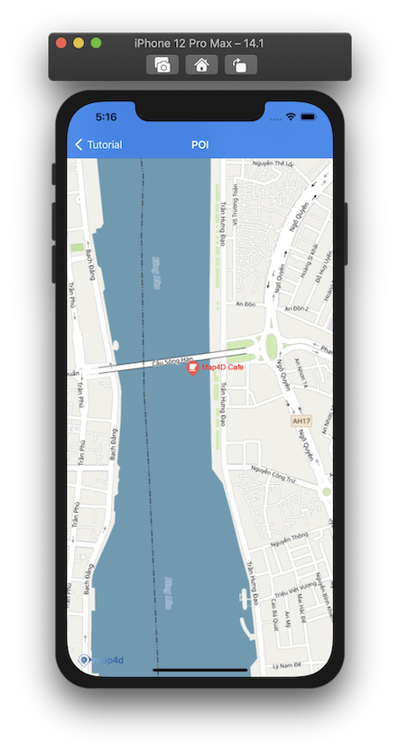
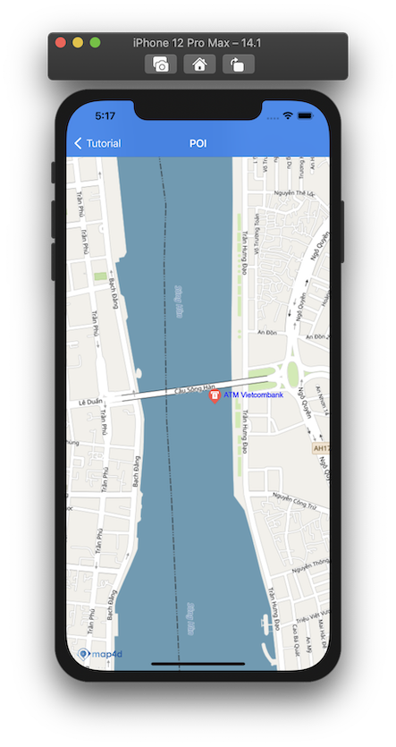

# POI

> Hiện tại trên bản đồ đã có những điểm đánh dấu địa điểm có sẵn (như địa danh công cộng, quán cà phê, nhà hàng, bến xe, ...)
và chúng chỉ hiển thị khi bản đồ ở chế độ 2D. Khi bạn cần một đối tượng để đánh dấu một địa điểm trên bản đồ tương tự như
những điểm có sẵn đó thì bạn có thể dùng lớp **MFPOI**. Các đối tượng **POI** bạn thêm vào bản đồ có thể hiện thị
ở **cả 2 chế độ 2D và 3D**.

### 1. Thêm một POI

Chúng ta thử tạo **POI** như sau:

<!-- tabs:start -->

#### ** Swift **

```swift 
let poi = MFPOI()
poi.position = CLLocationCoordinate2D(latitude: 16.071575666602996, longitude: 108.22781709595301)
poi.title = "Map4D Cafe"
poi.zIndex = 1
poi.type = "cafe"
poi.titleColor = red
poi.map = mapView
```

#### ** Objective C **

```objc 
MFPOI *poi = [[MFPOI alloc] init];
[poi setPosition:CLLocationCoordinate2DMake(16.071575666602996, 108.22781709595301)];
[poi setTitle: @"Map4D Cafe"];
[poi setZIndex: 1];
[poi setType: @"cafe"];
[poi setTitleColor: [UIColor redColor]];
[poi setMap: mapView];
```

<!-- tabs:end -->

 


### 2. Xóa POI khỏi bản đồ

Để xóa **POI** khỏi bản đồ, chúng ta **set** thuộc tính **map** bằng **nil**

<!-- tabs:start -->
#### ** Swift **

```swift
poi.map = nil
```

#### ** Objective C **

```objc 
[poi setMap: Nil];
```
<!-- tabs:end -->

Nếu bạn muốn quản lý một danh sách các **POI**, bạn nên tạo một **mảng** để chứa các **POI** đó. 

Sử dụng mảng này bạn có thể  **set** lần lượt thuộc tính **map** bằng **mapView** để hiển thị **POI** hoặc **nil** khi bạn cần xóa các **POI**.

### 3. Tùy chỉnh POI

Bạn có thể dễ dàng tuỳ chỉnh **POI** thông qua các thuộc tính mà **MFPOI** cung cấp như:

  
| Name                       |Description                                                                                                                                       |
|----------------------------|--------------------------------------------------------------------------------------------------------------------------------------------------|
| **position**               | Tuỳ chỉnh vị trí của **POI** được vẽ trên bản đồ                                                                                                 |
| **title**                  | Tuỳ chỉnh tiểu đề của **POI**, được hiển thị bên cạnh **POI** icon                                                                               |
| **titleColor**             | Tuỳ chỉnh màu của tiêu đề                                                                                                                        |
| **type**                   | Tuỳ chỉnh kểu của **POI**, dùng để quy định icon (bank, hospital, cafe, ...)                                                                     |
| **iconView**               | Tuỳ chỉnh icon của **POI** bằng UIView                                                                                                           |
| **icon**                   | Tuỳ chỉnh icon của **POI** bằng hình ảnh                                                                                                         |

- **position**: Tuỳ chỉnh vị trí của **POI** được vẽ trên bản đồ
- **title**: Tuỳ chỉnh tiểu đề của **POI**, được hiển thị bên cạnh **POI** icon
- **titleColor**: Tuỳ chỉnh màu của tiêu đề
- **type**: Tuỳ chỉnh kểu của **POI**, dùng để quy định icon (bank, hospital, cafe, ...) 
- **iconView**: Tuỳ chỉnh icon của **POI** bằng UIView
- **icon**: Tuỳ chỉnh icon của **POI** bằng hình ảnh

> - **Chú ý**: Người dùng có thể set icon cho **POI** bằng các cách sau (theo thứ tự ưu tiên):
    + ***Tuỳ biến lại POI bằng cách dùng hàm setIconView***
    + ***Sử dụng 1 hình ảnh làm icon dùng hàm setIcon***
    + ***Set type cho POI***

<!-- tabs:start -->

#### ** Swift **

```swift 
poi.title = "ATM Vietcombank"
poi.type = "atm"
poi.titleColor = .blue
```

#### ** Objective C **

```objc 
[poi setTitle: @"ATM Vietcombank"];
[poi setType: @"atm"];
[poi setTitleColor: [UIColor blueColor]];
```

<!-- tabs:end -->

 