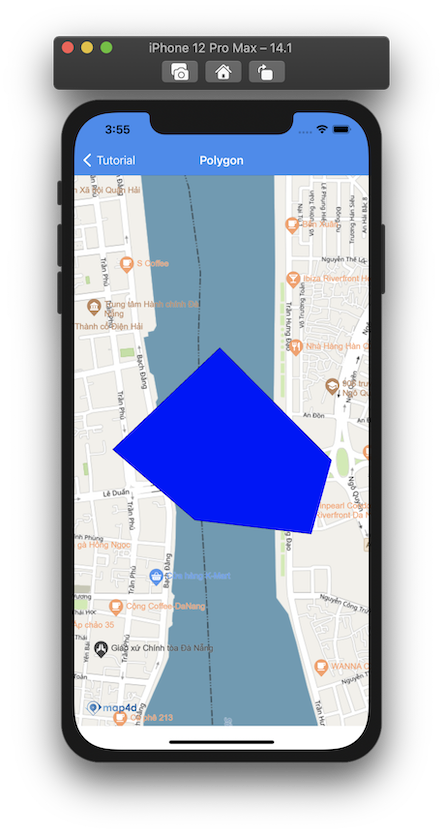
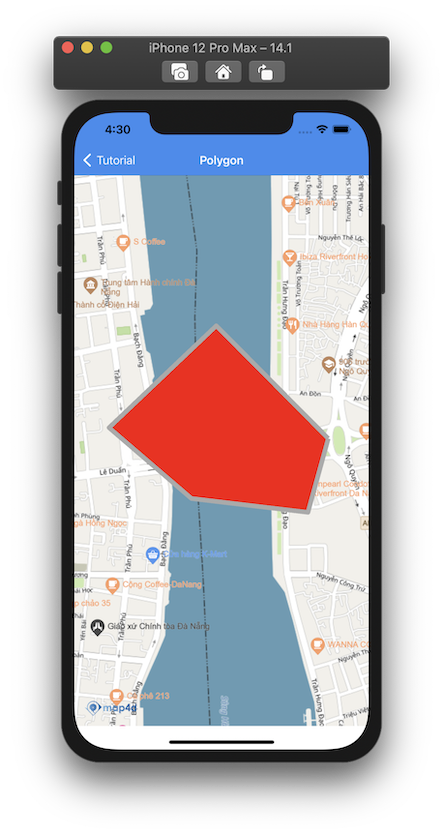
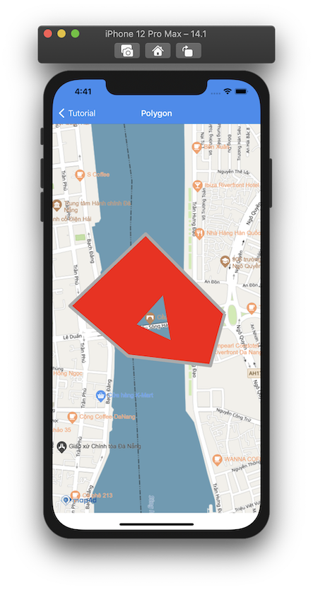

# Polygon

> Để vẽ các đa giác trên bản đồ thì ta sử dụng đối tượng MFPolygon. Một đối tượng MFPolygon bao gồm một mảng các điểm tọa độ
và tạo ra các đoạn thẳng nối các vị trí đó theo một trình tự có thứ tự.

### 1. Tạo một Polygon

Đoạn mã sau sẽ vẽ **Polygon** lên bản đồ:

<!-- tabs:start -->
#### ** Swift **

```swift 
let path = MFMutablePath()
path.add(CLLocationCoordinate2D(latitude: 16.072699584731552, longitude: 108.23020984691385))
path.add(CLLocationCoordinate2D(latitude: 16.07608106276882, longitude: 108.22671224150031))
path.add(CLLocationCoordinate2D(latitude: 16.0730244298952, longitude: 108.22336243622124))
path.add(CLLocationCoordinate2D(latitude: 16.070900670809152, longitude: 108.22593736045201))
path.add(CLLocationCoordinate2D(latitude: 16.070485456927244, longitude: 108.22957624088468))

let polygon = MFPolygon()
polygon.path = path
polygon.fillColor = .blue
polygon.map = mapView
```

#### ** Objective C **

```objc 
MFMutablePath *path = [[MFMutablePath alloc] init];
[path addCoordinate:CLLocationCoordinate2DMake(16.072699584731552, 108.23020984691385)];
[path addCoordinate:CLLocationCoordinate2DMake(16.07608106276882, 108.22671224150031)];
[path addCoordinate:CLLocationCoordinate2DMake(16.0730244298952, 108.22336243622124)];
[path addCoordinate:CLLocationCoordinate2DMake(16.070900670809152, 108.22593736045201)];
[path addCoordinate:CLLocationCoordinate2DMake(16.070485456927244, 108.22957624088468)];

MFPolygon *polygon = [[MFPolygon alloc] init];
[polygon setPath: path];
[polygon setFillColor: [UIColor blueColor]];
[polygon setMap: mapView];
```

<!-- tabs:end -->

 

Bạn có thể tùy chỉnh hình dáng của **Polygon** trước khi thêm nó vào bản đồ hoặc sau khi nó đã được thêm vào bản đồ.

### 2. Xóa Polygon khỏi bản đồ

Để xóa **Polygon** khỏi bản đồ, chúng ta **set** thuộc tính **map** bằng **nil**

<!-- tabs:start -->
#### ** Swift **

```swift
polygon.map = nil
```

#### ** Objective C **

```objc 
[polygon setMap: Nil];
```
<!-- tabs:end -->

### 3. Tùy chỉnh cho Polygon

Bạn có thể dễ dàng tuỳ chỉnh hình dáng của **Polygon** thông qua các thuộc tính mà **MFPolygon** cung cấp như
  
| Name                       |Description                                                                                                              |
|----------------------------|-------------------------------------------------------------------------------------------------------------------------|
| **path**                   | Truyền vào một mảng các tọa độ **CLLocationCoordinate2D** để tạo **Polygon**.                                           |
| **fillColor**              | Tuỳ chỉnh màu của **Polygon**.                                                                                          |
| **strokeWidth**            | Tuỳ chỉnh độ rộng **đường viền Polygon**.                                                                               |
| **strokeColor**            | Tuỳ chỉnh màu sắc của **đường viền Polygon**.                                                                           |

<!-- tabs:start -->
#### ** Swift **

```swift    
polygon.fillColor = .red
polygon.strokeWidth = 20.0
polygon.strokeColor = .lightGray
```

#### ** Objective C **

```objc 
[polygon setFillColor: [UIColor redColor]];
[polygon setStrokeWidth:20.0];
[polygon strokeColor: [UIColor lightGrayColor]];
```

<!-- tabs:end -->

 

### 4. Polygon có hole

**Polygon có hole** cũng tương tự như **Polygon** cũng mang các thuộc tính của **Polygon thông thường**, chỉ đặt biệt là 
nó có thêm các hole bên trong.

Đoạn mã sau sẽ vẽ **Polygon có hole** lên bản đồ:

<!-- tabs:start -->
#### ** Swift **

```swift 
let path = MFMutablePath()
path.add(CLLocationCoordinate2D(latitude: 16.072699584731552, longitude: 108.23020984691385))
path.add(CLLocationCoordinate2D(latitude: 16.07608106276882, longitude: 108.22671224150031))
path.add(CLLocationCoordinate2D(latitude: 16.0730244298952, longitude: 108.22336243622124))
path.add(CLLocationCoordinate2D(latitude: 16.070900670809152, longitude: 108.22593736045201))
path.add(CLLocationCoordinate2D(latitude: 16.070485456927244, longitude: 108.22957624088468))
path.add(CLLocationCoordinate2D(latitude: 16.072699584731552, longitude: 108.23020984691385))

let hole = MFMutablePath()
hole.add(CLLocationCoordinate2D(latitude: 16.073472611109437, longitude: 108.22747377269246))
hole.add(CLLocationCoordinate2D(latitude: 16.071575666602996, longitude: 108.22781709595301))
hole.add(CLLocationCoordinate2D(latitude: 16.072503522154975, longitude: 108.22573569886646))
hole.add(CLLocationCoordinate2D(latitude: 16.073946844408653, longitude: 108.22612193750109))

let polygon = MFPolygon()
polygon.path = path
polygon.holes = [hole]
polygon.fillColor = .red
polygon.strokeWidth = 20.0
polygon.strokeColor = .lightGray
polygon.map = mapView
```

#### ** Objective C **

```objc 
MFMutablePath *path = [[MFMutablePath alloc] init];
[path addCoordinate:CLLocationCoordinate2DMake(16.072699584731552, 108.23020984691385)];
[path addCoordinate:CLLocationCoordinate2DMake(16.07608106276882, 108.22671224150031)];
[path addCoordinate:CLLocationCoordinate2DMake(16.0730244298952, 108.22336243622124)];
[path addCoordinate:CLLocationCoordinate2DMake(16.070900670809152, 108.22593736045201)];
[path addCoordinate:CLLocationCoordinate2DMake(16.070485456927244, 108.22957624088468)];
[path addCoordinate:CLLocationCoordinate2DMake(16.072699584731552, 108.23020984691385)];

MFMutablePath *hole = [[MFMutablePath alloc] init];
[hole addCoordinate:CLLocationCoordinate2DMake(16.073472611109437, 108.22747377269246)];
[hole addCoordinate:CLLocationCoordinate2DMake(16.071575666602996, 108.22781709595301)];
[hole addCoordinate:CLLocationCoordinate2DMake(16.072503522154975, 108.22573569886646)];
[hole addCoordinate:CLLocationCoordinate2DMake(16.073946844408653, 108.22612193750109)];

NSMutableArray *holes = [[NSMutableArray alloc] init];
[holes addObject: hole];

MFPolygon *polygon = [[MFPolygon alloc] init];
[polygon setPath: path];
[polygon setHoles: holes];
[polygon setFillColor: [UIColor lightGrayColor]];
[polygon setStrokeWidth:20.0];
[polygon setFillColor: [UIColor redColor]];
[polygon setMap: mapView];
```

<!-- tabs:end -->

 