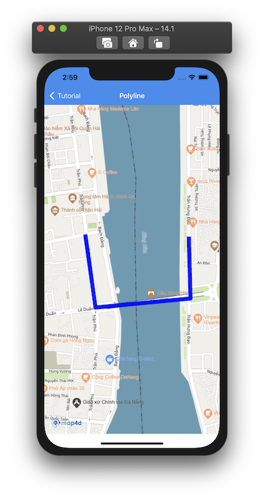
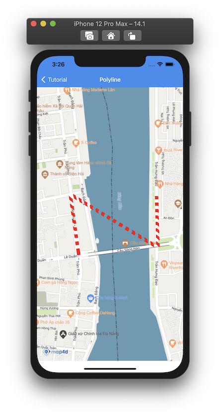

# Polyline

> Để vẽ các đường thẳng trên bản đồ thì ta sử dụng đối tượng **MFPolyline**. Một đối tượng **MFPolyline** bao gồm một mảng các điểm tọa độ
và tạo ra các đoạn thẳng nối các vị trí đó theo một trình tự có thứ tự.

### 1. Thêm một Polyline

Đoạn mã sau sẽ vẽ **Polyline** lên bản đồ:

<!-- tabs:start -->
#### ** Swift **

```swift 
let polyline = MFPolyline()
let path = MFMutablePath()
path.add(CLLocationCoordinate2D(latitude: 16.075370898415514, longitude: 108.22887796703878))
path.add(CLLocationCoordinate2D(latitude: 16.072266586439582, longitude: 108.22896530020222))
path.add(CLLocationCoordinate2D(latitude: 16.07181296817015, longitude: 108.22398711335603))
path.add(CLLocationCoordinate2D(latitude: 16.07548312266711, longitude: 108.22345067080795))
polyline.path = path
polyline.width = 10.0
polyline.color = .blue
polyline.map = mapView
```

#### ** Objective C **

```objc 
MFPolyline *polyline = [[MFPolyline alloc] init];
MFMutablePath *path = [[MFMutablePath alloc] init];
[path addCoordinate: CLLocationCoordinate2DMake(16.075370898415514, 108.22887796703878)];
[path addCoordinate: CLLocationCoordinate2DMake(16.072266586439582, 108.22896530020222)];
[path addCoordinate: CLLocationCoordinate2DMake(16.07181296817015, 108.22398711335603)];
[path addCoordinate: CLLocationCoordinate2DMake(16.07548312266711, 108.22345067080795)];
[polyline setPath: path];
[polyline setWidth: 10.0];
[polyline setColor: [UIColor blueColor]];
[polyline setMap: mapView];
```

<!-- tabs:end -->

-   

Bạn có thể tùy chỉnh hình dáng của **Polyline** trước khi thêm nó vào bản đồ hoặc sau khi nó đã được thêm vào bản đồ.

### 2. Xóa Polyline khỏi bản đồ

Để xóa **Polyline** khỏi bản đồ, chúng ta **set** thuộc tính **map** bằng **nil**

<!-- tabs:start -->
#### ** Swift **

```swift
polyline.map = nil
```

#### ** Objective C **

```objc 
[polyline setMap: Nil];
```
<!-- tabs:end -->

### 3. Tùy chỉnh cho Polyline

Bạn có thể dễ dàng tuỳ chỉnh hình dáng của **Polyline** thông qua các thuộc tính mà **MFPolyline** cung cấp như
 
| Name                       |Description                                                                                                              |
|----------------------------|-------------------------------------------------------------------------------------------------------------------------|
| **path**                   | Truyền vào một mảng các tọa độ **CLLocationCoordinate2D** để tạo **Polyline**.                                          |
| **width**                  | Tuỳ chỉnh độ rộng của **Polyline**.                                                                                     |
| **color**                  | Tuỳ chỉnh màu sắc của **Polyline**.                                                                                     |
| **style**                  | Tuỳ chỉnh **Polyline** là loại nét liền **solid** hay nét đứt **dotted**.                                               |

<!-- tabs:start -->
#### ** Swift **

```swift    
let path = MFMutablePath()
path.add(CLLocationCoordinate2D(latitude: 16.075370898415514, longitude: 108.22887796703878))
path.add(CLLocationCoordinate2D(latitude: 16.072266586439582, longitude: 108.22896530020222))
path.add(CLLocationCoordinate2D(latitude: 16.07548312266711, longitude: 108.22345067080795))
path.add(CLLocationCoordinate2D(latitude: 16.07181296817015, longitude: 108.22398711335603))
polyline.path = path
polyline.width = 10.0
polyline.color = .red
polyline.style = .dotted
```

#### ** Objective C **

```objc 
MFMutablePath *path = [[MFMutablePath alloc] init];
[path addCoordinate: CLLocationCoordinate2DMake(16.075370898415514, 108.22887796703878)];
[path addCoordinate: CLLocationCoordinate2DMake(16.072266586439582, 108.22896530020222)];
[path addCoordinate: CLLocationCoordinate2DMake(16.07548312266711, 108.22345067080795)];
[path addCoordinate: CLLocationCoordinate2DMake(16.07181296817015, 108.22398711335603)];
[polyline setPath: path];
[polyline setWidth: 10.0];
[polyline setColor: [UIColor redColor]];
[polyline setStyle: MFPolylineStyleDotted];
```

<!-- tabs:end -->
 
-   