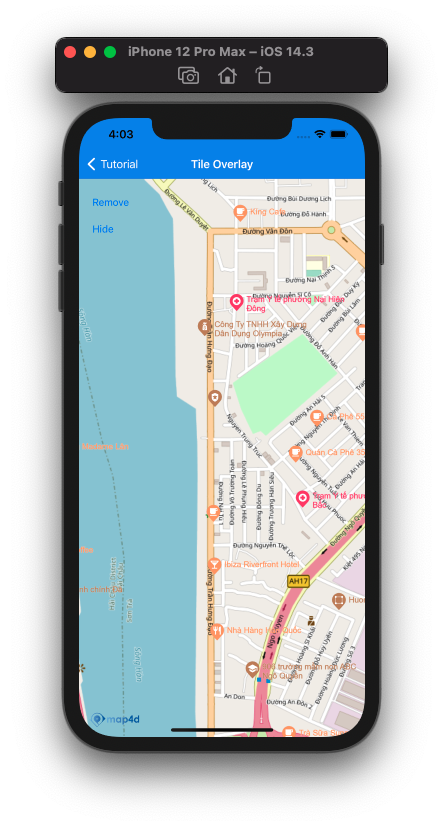

# Tile Overlay

Tile Overlay là một loại overlay cho phép người dùng hiển thị các tile map khác nhau từ nhiều nguồn khác nhau lên trên tile map có sẵn của Map4D



## Add Tile overlay

Để thêm 1 tile overlay vào map cần tạo mới 1 đối tượng của lớp [MFURLTileLayer](reference/tile-overlay?id=mfurltilelayer-class) sau đó set `map` cho đối tượng đó.  
Cần phải implement [MFTileURLConstructor](reference/tile-overlay?id=mftileurlconstructor-protocol)

### Tạo mới Tile overlay

Đoạn code bên dưới hướng dẫn cách sử dụng implement [MFTileURLConstructor](reference/tile-overlay?id=mftileurlconstructor-protocol) và sử dụng [MFURLTileLayer](reference/tile-overlay?id=mfurltilelayer-class) để hiển thị lớp tile từ `openstreetmap`

<!-- tabs:start -->
#### ** Swift **
Implement **MFTileURLConstructor**
```swift
class TileURLConstructor : NSObject, MFTileURLConstructor {
    func getTileUrlWith(x: UInt, y: UInt, zoom: UInt, is3dMode: Bool) -> URL? {
    let url = "https://tile.openstreetmap.de/\(zoom)/\(x)/\(y).png"
    return URL(string: url)
    }
}
```

Tạo đối tượng **MFURLTileLayer** và set `map`
```swift
let urlConstructor = TileURLConstructor()
let tileOverlay = MFURLTileLayer(urlConstructor: urlConstructor)
tileOverlay.map = mapView
```

#### ** Objective-C **

Implement **MFTileURLConstructor**

```objc
@interface TileURLConstructor : NSObject<MFTileURLConstructor>

- (NSURL * _Nullable)getTileUrlWithX:(NSUInteger)x y:(NSUInteger)y zoom:(NSUInteger)zoom is3dMode:(bool)is3dMode;

@end

@implementation TileURLConstructor

- (NSURL * _Nullable)getTileUrlWithX:(NSUInteger)x y:(NSUInteger)y zoom:(NSUInteger)zoom is3dMode:(bool)is3dMode {
  NSString *url = [NSString stringWithFormat:@"https://tile.openstreetmap.de/%lu/%lu/%lu.png", zoom, x, y];
  return [NSURL URLWithString:url];
}

@end
```

Tạo đối tượng **MFURLTileLayer** và set `map`
```objc
TileURLConstructor * urlConstructor = [[TileURLConstructor alloc] init];
MFURLTileLayer * tileOverlay = [MFURLTileLayer tileLayerWithURLConstructor:urlConstructor];
[tileOverlay setMap:mapView];
```
<!-- tabs:end -->

### Remove title overlay

Để xoá tile overlay khỏi map, ta set đối tượng `map` của tile overlay về rỗng
<!-- tabs:start -->
#### ** Swift **
```swift
tileOverlay.map = nil
```
#### ** Objective-C **
```objc
tileOverlay.map = nil;
```
<!-- tabs:end -->

### Ẩn/Hiện Tile Overlay
Set giá trị cho thuộc tính `isHidden` để ẩn/hiện tile overlay.  
Chú ý: Mặc dù tile overlay không hiển thị nhưng quá trình tải các tile vẫn diễn ra

<!-- tabs:start -->
#### ** Swift **
```swift
tileOverlay.isHidden = true
```
#### ** Objective-C **
```objc
tileOverlay.isHidden = YES;
```
<!-- tabs:end -->