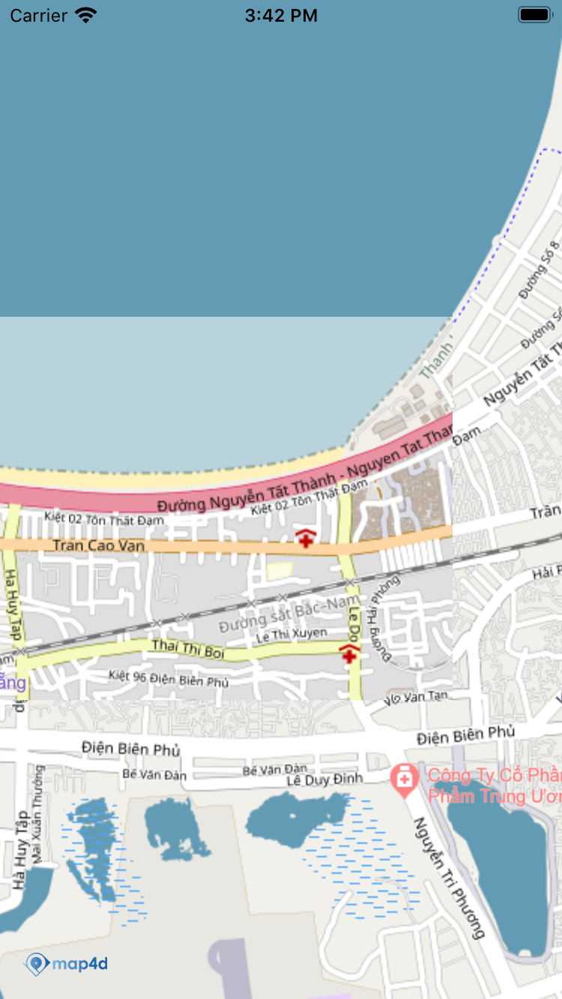

# Ground Overlay
Lớp MFGroundOverlay cho phép người dùng vẽ raster tile chồng lên map4d tile ở một khu vực nào đó


## 1. MFGroundOverlay

- Static method:
    + groundOverlayWithBounds:mapUrl:
        + Tạo MFGroundOverlay bằng chuỗi dường dẫn đến raster tile
        + Có dạng http:://example.com/{z}/{x}/{y}, trong đó z là mức zoom, x, y là tọa độ của tile coordinate
    + groundOverlayWithBounds:mapUrl:overrideBaseMap:
        + Tương tự groundOverlayWithBounds:mapUrl: nhưng kèm tham số overrideBaseMap, dùng để xác định overlay đó có được ghi đè lên map4d base map hay không, nếu có thì ở tile đó sẽ không xuất hiện poi hay building của map4d
    + groundOverlayWithBounds:tileURLConstructor:
        + Tạo MFGroundOverlay bằng URLConstructor, cần implement MFTileURLConstructor (xem Tile Overlay)
    + groundOverlayWithBounds:tileURLConstructor:overrideBaseMap:
        + Tạo MFGroundOverlay bằng URLConstructor và xác định có override base map hay không

- Properties:
    - map:MFMapView
        - Map view chứa Ground Overlay
    - isHidden:bool
        - Cho phép ẩn Ground Overlay khỏi map
    - zIndex:float
        - zIndex của Ground Overlay, dùng để quy định thứ tự của các overlay này đối với overay khác (tile overlay, ground overlay)

## 2. Tạo Ground Overlay

  -   
  
```switf
    let bounds = MFCoordinateBounds(coordinate: CLLocationCoordinate2DMake(16.057814922971613, 108.22065353393553),
                                    coordinate1: CLLocationCoordinate2DMake(16.064289641988594, 108.2324981689453))
    let groundOverlay = MFGroundOverlay(bounds: bounds, mapUrl: "https://tile.openstreetmap.de/{z}/{x}/{y}.png")
    groundOverlay.map = mapView
```

```switf
    class TileUrlConstructor : NSObject, MFTileURLConstructor {
      func getTileUrlWith(x: UInt, y: UInt, zoom: UInt, is3dMode: Bool) -> URL? {
          return URL(string: "https://tile.openstreetmap.de/\(zoom)/\(x)/\(y).png")
      }
    }
    let bounds = MFCoordinateBounds(coordinate: CLLocationCoordinate2DMake(16.067588780844506, 108.18391799926758),
                                    coordinate1: CLLocationCoordinate2DMake(16.075671439786362, 108.19833755493164))
    let groundOverlay = MFGroundOverlay(bounds: bounds, tileURLConstructor: TileUrlConstructor(), overrideBaseMap: true)
    groundOverlay.map = mapView
```

 - **Chú ý**:
   - overrideBaseMap dùng để quy định Ground Overlay ghi đè lên map4d base map hay không
   - Nếu set overrideBaseMap:true thì ở khu vực của ground overlay sẽ không xuất hiện map4d poi và raster


License
-------

Copyright (C) 2020 IOT Link Ltd. All Rights Reserved.