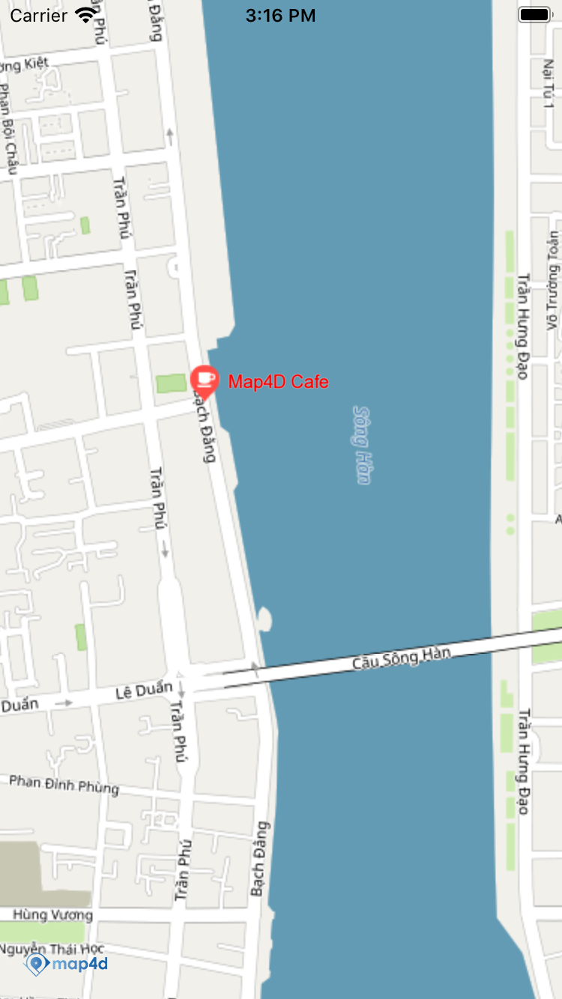

# POI
Lớp MFPOI cho phép người dùng vẽ một POI lên map.


## 1. MFPOI

```objective-c
@interface MFPOI : MFOverlay
  @property(nonatomic) CLLocationCoordinate2D position;
  @property(nonatomic, strong, nullable) NSString* title;
  @property(nonatomic, strong, nonnull) UIColor* titleColor;
  @property(nonatomic, strong, nullable) NSString* subtitle;
  @property(nonatomic, strong, nullable) NSString* type;
  @property(nonatomic, strong, nullable, setter=setIconView:) UIView * iconView;
  @property(nonatomic, strong, nullable) UIImage* icon;
  @property(nonatomic, getter=isUserInteractionEnabled) bool userInteractionEnabled;
  - (instancetype _Nonnull) init;
@end
```

- Properties:
  + position: vị trí của POI được vẽ trên bản đồ
  + title: title của POI, được hiển thị bên cạnh POI icon
  + titleColor: màu của title
  + type: kểu của POI, dùng để quy định icon (bank, hospital, cafe, ...) 
  + iconView: POI icon
  + icon: POI icon
  + userInteractionEnabled: cho phép POI có bị tác động bởi người dùng hay không, khi POI được set userInteractionEnabled là false thì sự kiện click đối với POI đó không hoạt động

## 2. Tạo POI

  -   
  
```switf
  let poi = MFPOI()
  poi.position = CLLocationCoordinate2DMake(16.07558896533373, 108.2243013381958)
  poi.title = "Map4D Cafe"
  poi.zIndex = 2
  poi.type = "cafe"
  poi.titleColor = UIColor.red
  poi.map = mapView
```
 - **Chú ý**:
 - Người dùng có thể set icon cho POI bằng các cách sau (theo thứ tự ưu tiên):
   - ***Tuỳ biến lại marker bằng cách dùng hàm setIconView***
   - ***Sử dụng 1 hình ảnh làm icon dùng hàm setIcon***
   - ***Set type cho POI***

## 3. Sự kiện click POI

  - Phát sinh khi người dùng click vào POI
    ```objective-c
      - (void)mapView: (MFMapView*)  mapView didTapPOI: (MFPOI*) poi;
    ```


License
-------

Copyright (C) 2020 IOT Link Ltd. All Rights Reserved.