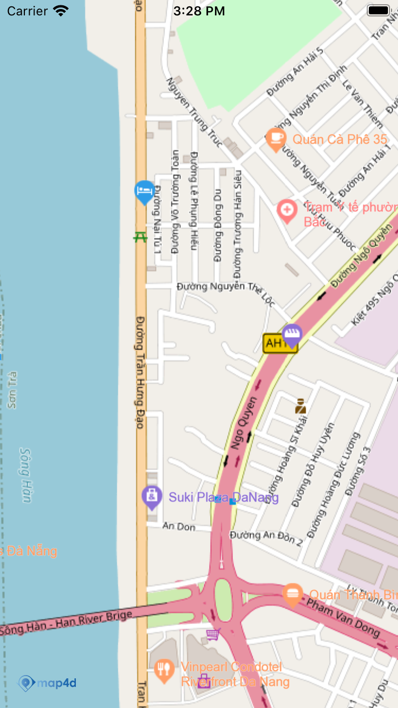

# Tile Overlay
Lớp MFURLTileLayer cho phép người dùng vẽ raster tile chồng lên map4d tile


## 1. MFURLTileLayer

- Static method:
    + tileLayerWithURLConstructor:
        + Tạo một MFURLTileLayer bằng MFTileURLConstructor, cần implement protocol MFTileURLConstructor

- Properties:
    - map:MFMapView
        - Map view mà tile overlay được thêm vào
    - isHidden:bool
        - Cho phép ẩn tile overlay hay không, mặc định là false
    - zIndex:float
        - zIndex của tile overlay, dùng để sắp xếp tile overlay này có nằm trên tile overlay khác, ground overlay khác hay không

- Methods:
    - clearTileCache
        - Dùng để reload tile overlay và xóa bỏ overlay hiện có trong cache

## 2. MFTileURLConstructor

```objective-c
@protocol MFTileURLConstructor <NSObject>
- (NSURL* _Nullable) getTileUrlWithX:(NSUInteger)x y:(NSUInteger)y zoom:(NSUInteger)zoom is3dMode:(bool)is3dMode;
@end
```

## 3. Tạo Tile Overlay

  -   
  
```switf
  class TileUrlConstructor : NSObject, MFTileURLConstructor {
    func getTileUrlWith(x: UInt, y: UInt, zoom: UInt, is3dMode: Bool) -> URL? {
        if (is3dMode) {
        return nil
        }
        return URL(string: "https://tile.openstreetmap.de/\(zoom)/\(x)/\(y).png")
    }
  }
  let tileOverlay = MFURLTileLayer(urlConstructor: TileUrlConstructor())
  tileOverlay.map = mapView
```

License
-------

Copyright (C) 2020 IOT Link Ltd. All Rights Reserved.